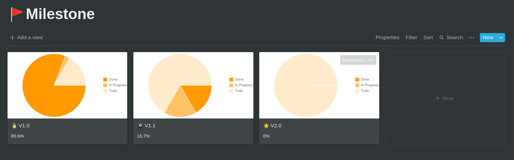
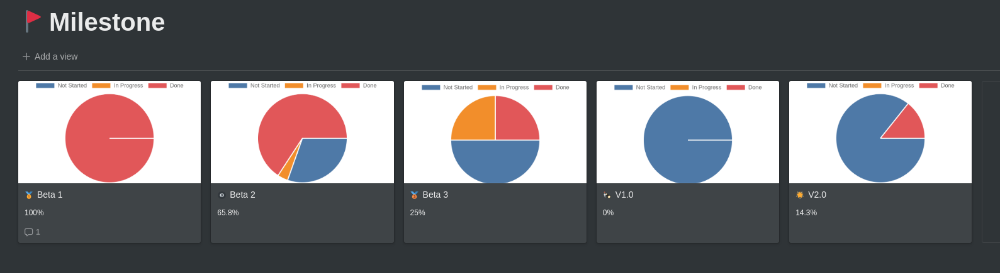

# Notion Charts



> Notion Charts is a simple tool to create beautiful charts for [Notion.so](https://notion.so/).

<details>
  <summary>See more examples</summary>

  ### Business Dashboard
  

  ### Dev Dashboard
  
  
</details>


# Usage

## For public Notion pages

Simply use https://charts.mathix.ninja url, and follow the documentation below.

## For private Notion pages

You'll need to host your own version of this repository.
The best way to do that is by clicking this button below, it will automatically host this API on [vercel.com](https://vercel.com/) which is **100% free**.

<details>
  <summary>Show me the steps</summary>

  1. Click the blue **Deploy** button on this page
  2. Log in or sign up to continue.
  3. Choose a name for your project, keep in mind that this name will goes in your url `https://YOUR-PROJECT-NAME.vercel.app`
  4. Follow instructions and don't forget to put your notion `TOKEN_V2` before clicking **Continue** [If you don't know how to get it, click here](/docs/notion-token.md)
  5. Click **Continue** one more time, and you're done!
  6. Leave me a **Star** on github 😋

</details>

Then when the hosting is completed simply follow documentation instructions below and enjoy 😎 
Don't forget to use your URL instead of `charts.mathix.ninja`.

[](https://vercel.com/new/git/external?repository-url=https%3A%2F%2Fgithub.com%2Fmathix420%2Fnotion-charts.git&env=TOKEN_V2&envDescription=Notion%20session%20cookie&envLink=https%3A%2F%2Fgithub.com%2Fmathix420%2Fnotion-charts%2Fblob%2Fmaster%2Fdocs%2Fnotion-token.md)

If you want to stay up to date I recommend you to use a [Deploy Hook](https://vercel.com/docs/v2/more/deploy-hooks).


# Principles

> There is only 2 principles to understand in Notion Charts.

## 1. The aggregator

> The first "column" you set-up on Notion Charts is called the aggregator.

It's used to group your database by it's values.

For example if you have a database which contains peoples (`name`, `age`, `height`, `weight`).

By setting your aggregator to the `age` column all these people will be grouped by their ages. So if the second Notion Chart "column" is the `height` with the `avg` action, you will plot the average height by ages of your dataset.

## 2. Actions

> Actions are performed on column datas, in order to obtain specific results.

Right now there is 4 actions possible:

- `value` => Simply return the value of the cell.
- `count` => Will count how many items are in the aggregated set.
- `sum` => Return sum of all values in the aggregated set. (only works with numbers)
- `avg` => Return average of all values in the aggregated set. (only works with numbers)

# Examples

## Todo-list pie chart

> **Notion Database:** [Notion Task List](https://www.notion.so/mathix/efe5f941ce5e415da072615ee12b4a77?v=9e890bfd058a4d07af5b6024ec0a6e0a)
> 
> **Columns:** `Status:value | Status:count`
> 
> **Chart URL:** https://charts.mathix.ninja/schema-chart/efe5f941ce5e415da072615ee12b4a77/9e890bfd058a4d07af5b6024ec0a6e0a?s=Status%3A3E6J%3Avalue%2CCount%3A3E6J%3Acount&t=PieChart

<details>
  <summary>Image preview</summary>

  

</details>

## Type repartition of non-evolving Pokémons

> **Notion Database:** [Non-evolving Pokémon](https://www.notion.so/d27bb47228d541a7a979bed894fb7533?v=9667c7a342fb43d88686776c52a6262e)
> 
> **Columns:** `Primary Type:value | Primary Type:count`
> 
> **Chart URL:** https://charts.mathix.ninja/schema-chart/d27bb47228d541a7a979bed894fb7533/9667c7a342fb43d88686776c52a6262e?s=Type%3A%29P%7CF%3Avalue%2CCount%3A%29P%7CF%3Acount&t=PieChart

<details>
  <summary>Image preview</summary>

  

</details>

## Specs by type of non-evolving Pokémons

> **Notion Database:** [Non-evolving Pokémon](https://www.notion.so/d27bb47228d541a7a979bed894fb7533?v=9667c7a342fb43d88686776c52a6262e)
>
> **Columns:** `Primary Type:value | HP:avg | Attack:avg | Defense:avg`
>
> **Chart URL:** https://charts.mathix.ninja/schema-chart/d27bb47228d541a7a979bed894fb7533/9667c7a342fb43d88686776c52a6262e?s=Type%3A%29P%7CF%3Avalue%2CHP%3AHkft%3Aavg%2CAttack%3AB%2F%29Q%3Aavg%2CDefense%3Aq%2B%2BI%3Aavg&t=LineChart

<details>
  <summary>Image preview</summary>

  

</details>

## Pokedex normal types candle-stick chart

> **Notion Database:** [Normal Type Pokédex](https://www.notion.so/9201f4ac42814afdbcdbee910c919e3f?v=2eb8d4fb18184bfb8cc7cd7b8c5ef002)
>
> **Columns:** `Name:value | HP:value | Attack:value | Defense:value | Speed:value`
>
> **Chart URL:** https://charts.mathix.ninja/schema-chart/2b5e6a6389e64f3298ab97005f4e6a35/9ef790d411504c70b437361169034b42?s=Name%3Atitle%3Avalue%2CPoints%3AHkft%3Avalue%2C%3AB%2F%29Q%3Avalue%2C%3Aq%2B%2BI%3Avalue%2C%3A8CLR%3Avalue&t=CandlestickChart

<details>
  <summary>Image preview</summary>

  

</details>

# API Documentation

> This part of the documentation is for power users. (API only)

For fast and easy previews you can now [go directly here](https://charts.mathix.ninja).


## Split notion url

```html
https://www.notion.so/fa9b093633c0479f886fdb857f57f9b0?v=c94a0043c3df410cb461e7698cee6aff

<collection> = fa9b093633c0479f886fdb857f57f9b0

<view> = c94a0043c3df410cb461e7698cee6aff
```

## Image charts

> Generate a chart image based on [Chart.js](https://www.chartjs.org/), uses [QuickChart.io](https://quickchart.io/).

[`GET`] => `/image-chart/<collection>/<view>?s=SCHEMA&t=CHART_TYPE`

### Query parameters

[REQUIRED] `t` => `line | bar | radar | doughnut | pie | polarArea | bubble | scatter`

[REQUIRED] `s` => [[`ColumnName:ColumnIndex:action`], ...]

- `ColumnName` => Display name of the selected Notion column.
- `ColumnIndex` => Notion Index of the selected column.
- `action` => Action to perform on the column data. (See [Actions](#2-actions))


## Interactives charts

> Generate an html page containing a chart based on [Google Charts](https://developers.google.com/chart).

[`GET`] => `/schema-chart/<collection>/<view>?s=SCHEMA&t=CHART_TYPE&dark`

### Query parameters

[REQUIRED] `t` => `line | bar | radar | doughnut | pie | polarArea | bubble | scatter`

[REQUIRED] `s` => [[`ColumnName:ColumnIndex:action`], ...]

- `ColumnName` => Display name of the selected Notion column.
- `ColumnIndex` => Notion Index of the selected column.
- `action` => Action to perform on the column data. (See [Actions](#2-actions))

[OPTIONAL] `dark` => If set in url, a Notion dark theme is applied.

# Open for contributions

Please feel free to contribute to this project!